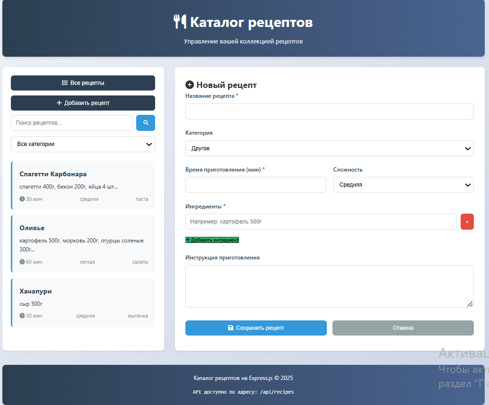
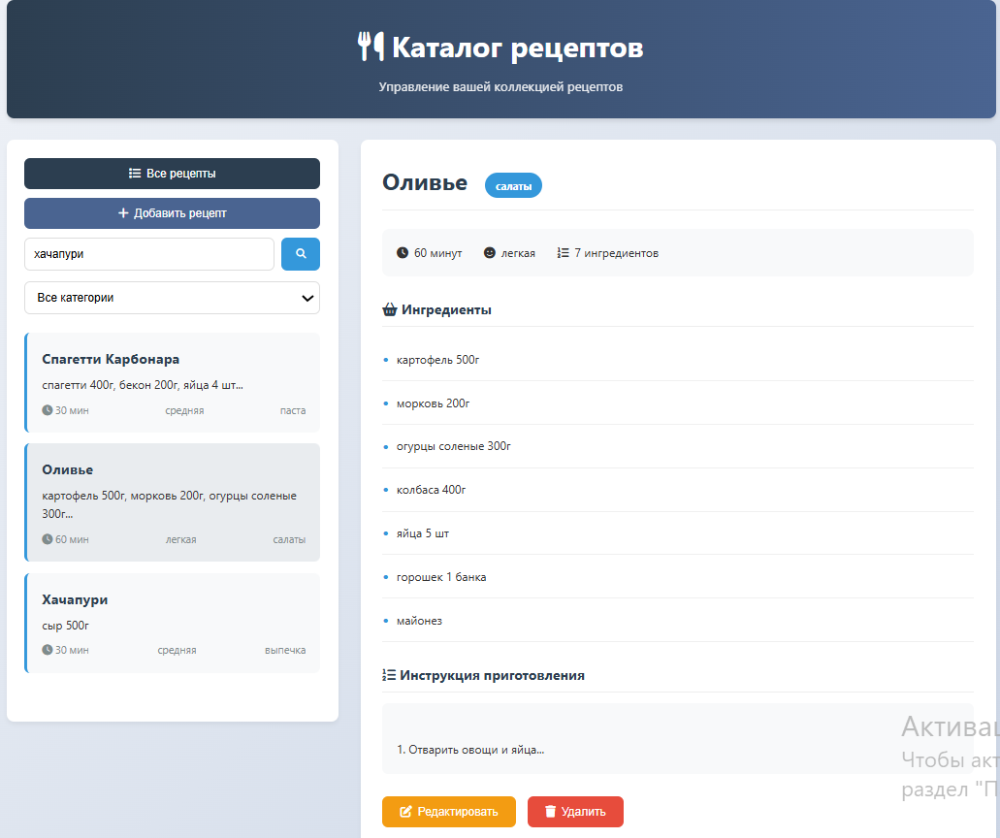

# Каталог рецептов на Express.js

Веб-приложение для управления коллекцией рецептов с REST API.

## Функционал

- 📋 Просмотр списка рецептов
- 🔍 Поиск рецептов по названию и ингредиентам
- 🏷️ Фильтрация по категориям
- ➕ Добавление новых рецептов
- ✏️ Редактирование существующих рецептов
- ❌ Удаление рецептов
- 📱 Адаптивный интерфейс

## Технологии

- **Backend**: Node.js + Express.js
- **Frontend**: HTML5, CSS3, Vanilla JavaScript
- **Хранение данных**: JSON файл
- **Сервер**: Встроенный HTTP сервер Node.js
